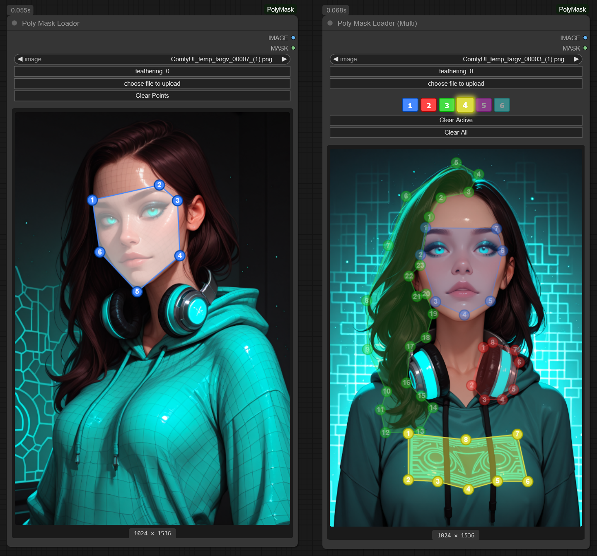

# ComfyUI-PolyMask

A ComfyUI custom node for creating polygon masks directly in the workflow editor.



## Features

- **Poly Mask Loader** - Single polygon mask creation
- **Poly Mask Loader (Multi)** - Up to 6 polygon masks with additive/subtractive modes

### Controls

| Action | Result |
|--------|--------|
| Left click on canvas | Add point to active polygon |
| Left click + drag point | Move point |
| Left click on line | Insert new point |
| Right click on point | Delete point |
| Click button in + row | Set polygon to additive mode & select |
| Click button in − row | Set polygon to subtractive mode & select |

### Polygon Modes

| Mode | Symbol | Effect |
|------|--------|--------|
| **Additive** | + | Adds polygon shape to the mask |
| **Subtractive** | − | Removes polygon shape from the mask |

- Polygons are processed in order (1→6)
- Higher-numbered polygons override lower ones in overlapping areas
- Subtractive polygons appear with darker colors and dashed lines

### Parameters

- **Feathering** - Blur/soften mask edges (0-100)

## Installation

### Option 1: Git Clone

```bash
cd ComfyUI/custom_nodes/
git clone https://github.com/Carasibana/ComfyUI-PolyMask.git
```

### Option 2: Download ZIP

1. Download the repository as ZIP
2. Extract to `ComfyUI/custom_nodes/ComfyUI-PolyMask`

Then restart ComfyUI.

## Usage

Find the nodes under the **image** category:

- `Poly Mask Loader` - For single polygon masks
- `Poly Mask Loader (Multi)` - For multiple polygon masks with additive/subtractive support

### Example Workflow

1. Add a `Poly Mask Loader (Multi)` node
2. Select an image
3. Click a number in the **+** row to create an additive polygon
4. Draw points on the canvas to define the mask area
5. Optionally click a number in the **−** row to create a subtractive polygon that cuts out from existing masks
6. Adjust feathering as needed

## License

MIT License - see [LICENSE](LICENSE) for details.

## Author

[Carasibana](https://github.com/Carasibana)